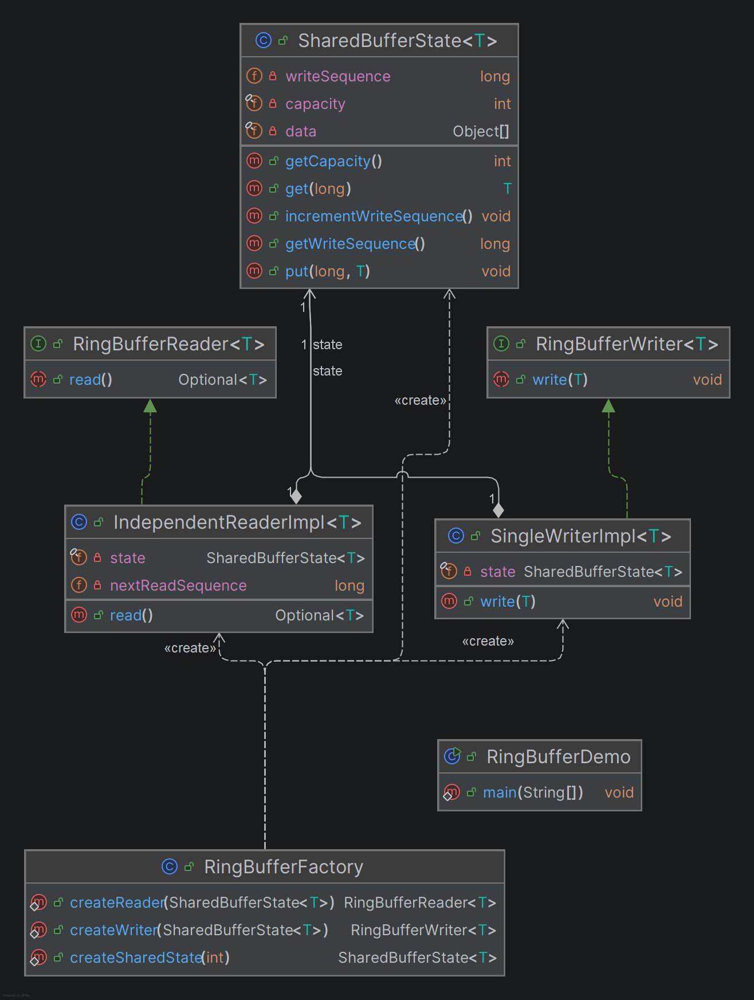
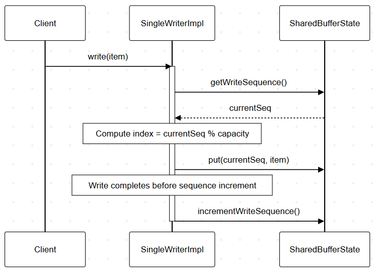
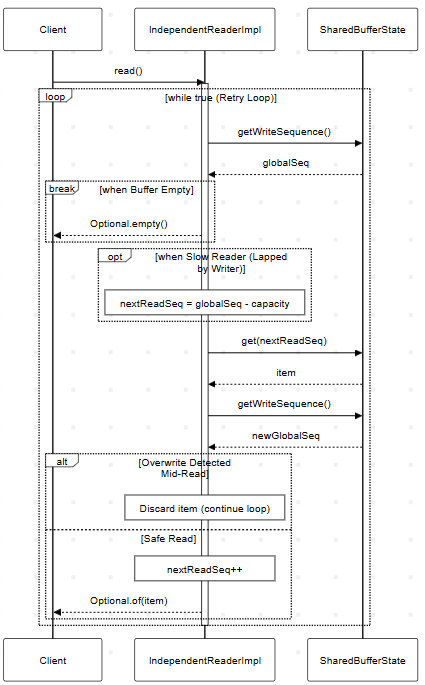

# Ring Buffer (Multiple Readers, Single Writer)

## Project Overview

This project implements a generic Ring Buffer that supports:

- A single writer
- Multiple readers
- Independent reading positions per reader
- Overwriting of oldest data when capacity is exceeded

The buffer has a fixed capacity `N`. When the buffer becomes full, new writes overwrite the oldest entries. Slow readers may miss overwritten items and automatically catch up to the oldest available data.

---

## Requirements Coverage

### 1. Fixed Capacity
The `SharedBufferState<T>` class initializes a fixed-size internal array (`Object[] data`) based on the given capacity.

### 2. Single Writer
The design assumes a single writer per shared buffer state.  
Only one `SingleWriterImpl<T>` should be created for a given `SharedBufferState<T>`.

>  **Important Note:**  
> The current design enforces single-writer usage by convention, not by runtime restriction.  
> The assignment requirements do not explicitly demand preventing multiple writer instances, therefore the system assumes correct usage rather than enforcing it via Singleton or hard constraints.

### 3. Multiple Readers
Multiple `IndependentReaderImpl<T>` instances can be created, all referencing the same `SharedBufferState<T>`.

### 4. Independent Reading Positions
Each reader maintains its own `nextReadSequence` counter, allowing independent progress through the buffer.

### 5. Reading Does Not Remove Data
Readers only advance their personal sequence counter. Data remains in the buffer until overwritten by the writer.

### 6. Overwrite When Full
The ring buffer uses modulo indexing:

```
index = sequence % capacity
```

When the writer sequence exceeds capacity, older entries are overwritten automatically.

### 7. Slow Reader Handling
If a reader is overtaken (lapped) by the writer:

```
globalSeq - nextReadSeq > capacity
```

The reader jumps forward to the oldest surviving sequence:

```
nextReadSeq = globalSeq - capacity
```

---

## Design Structure (Responsibilities)

### `SharedBufferState<T>`
- Stores buffer array
- Maintains global write sequence
- Provides low-level `put()` and `get()` access
- Contains no reader logic

### `SingleWriterImpl<T>`
- Implements `RingBufferWriter<T>`
- Writes data into buffer
- Increments write sequence after successful write

### `IndependentReaderImpl<T>`
- Implements `RingBufferReader<T>`
- Maintains independent read sequence
- Handles slow-reader detection and retry logic

### `RingBufferFactory`
- Responsible for object creation
- Creates shared state, writer, and readers

---

## UML Class Diagram



---

## UML Sequence Diagram — write()



---

## UML Sequence Diagram — read()



---

## How to Run

1. Compile the project.
2. Run `RingBufferDemo.java`.

To run tests (JUnit):
- Execute `RingBufferTest` from your IDE.

---

## Notes on Diagrams

### UML Class Diagram

The UML Class Diagram was generated using the built-in diagram tools of **IntelliJ IDEA**.

- The diagram is automatically derived from the source code.
- It follows standard **UML 2.x class diagram conventions** (classes, interfaces, attributes, methods, visibility, associations, and realizations).
- Since the diagram is generated directly from the implemented code, it accurately reflects the actual structure of the system.

### UML Sequence Diagrams

The sequence diagrams for `read()` and `write()` were written using **Mermaid** syntax and visualized using:

https://mermaid.live/edit

They follow standard UML sequence diagram semantics:
- Lifelines (participants)
- Message calls
- Return values
- Loop fragments
- Alternative (`alt`) and optional (`opt`) fragments

These diagrams were manually written to precisely match the implementation logic.
The diagram PNGs as well as mermaid codes are in assets